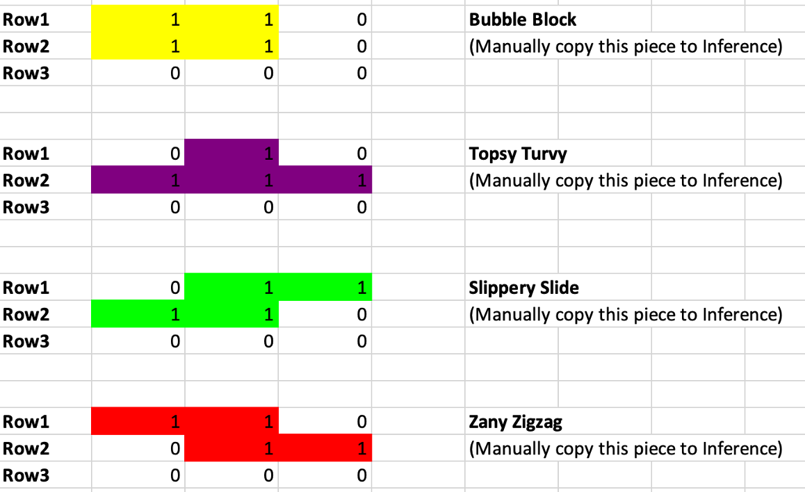

# CNN in Excel Project

This project demonstrates a simple Convolutional Neural Network (CNN) implemented within an Excel spreadsheet.

## Overview

This project provides an educational and visual approach to understanding the core operations of a CNN using Excel.

## Key Concepts

*   **Convolution:** Implemented using Excel's `SUMPRODUCT` function.
*   **ReLU Activation:** The Rectified Linear Unit (ReLU) activation is implemented using Excel's `MAX` function.
*   **Dense Layer:** A fully connected layer with adjustable weights and biases.
*   **Softmax:** Softmax probabilities are computed.

## Files

*   `cnn_excel_training.py`: This python file trains the model and then creates the excel file.
*   `cnn_inference_trained.xlsx`: The Excel file that performs the CNN calculations.
*   `Tetris.png`: An image representing Tetris shapes or elements.

## Getting Started

1.  **Clone the repository.**
2. **Install requirements**: `pip install numpy openpyxl`
3.  **Run the training script:** `python cnn_excel_training.py`
4.  **Open `cnn_inference_trained.xlsx`**.

## Image

